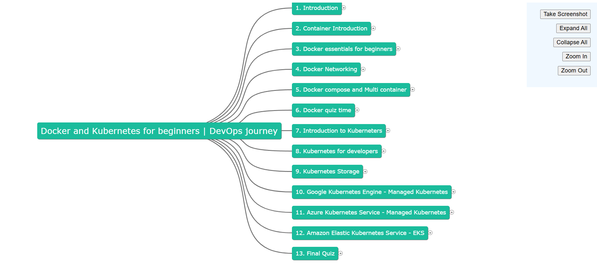

# Map My Udemy

## Problem Statement

Keeping track of Udemy course content sometimes become overwhelming due to endless sections and its items.

## Solution

Map My Udemy is a chrome extension that lets one generate mind map of a particular udemy course so that one can keep track of every content present in it.



## Features

1. Take Screenshot of mind map
2. Expand/Collapse map nodes
3. Zoom in/ zoom out canvas

## Setup

1. Clone the repository:

```bash
git clone https://github.com/harshitrajsinha/map-my-udemy.git
```

2. Create .env file in map-my-udemy directory and configure variables:

```bash
cd map-my-udemy

mkdir .env

PORT=3000
BACKEND_SERVER=http://localhost
```

3. Install necessary files

```bash
npm install
```

4. Install necessary files

```bash
npm run dev
```

5. Setup chrome Extension
   Browser -> Extensions -> Manage Extension -> Enable 'Developer mode' -> Load unpacked -> Select chrome-extension folder present in map-my-udemy/ -> Use the extension
